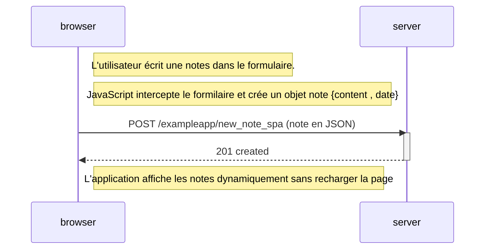

```mermaid
sequenceDiagram
    participant browser
    participant server

    Note right of browser : L'utilisateur écrit une notes dans le formulaire.

    Note right of browser: JavaScript intercepte le formilaire et crée un objet note {content , date}

    browser->>server: POST /exampleapp/new_note_spa (note en JSON)
    activate server
    server-->>browser: 201 created
    deactivate server

    Note right of browser: L'application affiche les notes dynamiquement sans recharger la page
```
